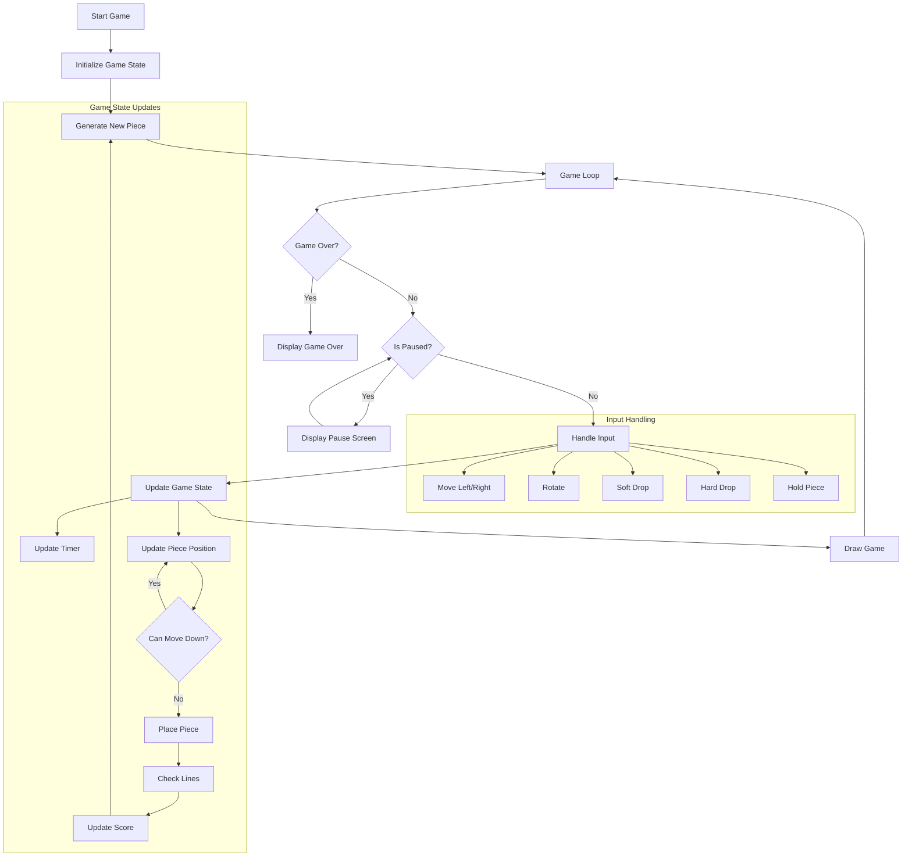

# 🎮 Python Tetris Game

A modern implementation of the classic Tetris game using Pygame, featuring smooth gameplay, piece holding, and a scoring system.


## 📋 Table of Contents
- [Features](#-features)
- [Installation](#-installation)
- [How to Play](#-how-to-play)
- [Game Controls](#-game-controls)
- [Game Logic](#-game-logic)
- [Scoring System](#-scoring-system)
- [Technical Details](#-technical-details)

## ✨ Features
- 🎯 Classic Tetris gameplay with modern visuals
- 📊 Score tracking and level progression
- ⏱️ Game timer
- 💾 Piece holding mechanism
- 🎲 Smart piece generation (prevents unfair sequences)
- ⏸️ Pause functionality
- 🎨 Clean, modern UI with grid visualization
- 📈 Dynamic difficulty scaling

## 🚀 Installation

1. Ensure you have Python 3.x installed on your system
2. Install the required dependencies:
```bash
pip install pygame
```
3. Clone this repository or download the source code
4. Run the game:
```bash
python "tetris-game.py"
```

## 🎮 How to Play

The goal is to clear as many lines as possible by arranging falling tetromino pieces. The game ends when the pieces stack up to the top of the playing field.

## 🎹 Game Controls

| Key | Action |
|-----|--------|
| ← | Move piece left |
| → | Move piece right |
| ↓ | Soft drop (move down faster) |
| ↑ | Rotate piece |
| Space | Hard drop (instantly drop piece) |
| C | Hold piece |
| P | Pause/Resume game |
| R | Restart game |

## 🔄 Game Logic



## 💯 Scoring System

The scoring system is based on the number of lines cleared simultaneously:

| Lines Cleared | Base Points | Level Multiplier |
|---------------|-------------|------------------|
| 1 line | 100 | × Level |
| 2 lines | 300 | × Level |
| 3 lines | 500 | × Level |
| 4 lines | 800 | × Level |

- Level increases every 10 lines cleared
- Fall speed increases with level
- Maximum level: 10 (fall speed capped)

## 🔧 Technical Details

### Game Components

1. **Tetromino Class**
   - Handles piece properties and rotation
   - Manages piece movement and collision detection

2. **PieceGenerator Class**
   - Implements the "bag" system for piece generation
   - Prevents unfair sequences (max 2 consecutive same pieces)

3. **TetrisGame Class**
   - Main game logic and state management
   - Handles game loop, scoring, and rendering
   - Manages piece placement and line clearing

### Key Constants
- Screen Size: 1024×900 pixels
- Grid Size: 10×20 blocks
- Block Size: 30 pixels
- Initial Fall Speed: 0.5 seconds per step
- Minimum Fall Speed: 0.05 seconds per step

### Color Scheme
- I Piece: Cyan
- J Piece: Blue
- L Piece: Orange
- O Piece: Yellow
- S Piece: Green
- T Piece: Purple
- Z Piece: Red

## 🛠️ Development

The game is built using:
- Python 3.x
- Pygame library
- Object-oriented programming principles
- Modern game development practices

## 🤝 Contributing

If you'd like to contribute to this project, please:
1. Fork the repository
2. Create a feature branch
3. Make your changes
4. Submit a pull request

Feel free to open issues for bug reports or feature suggestions.

---
## Author
Made John Morfidis